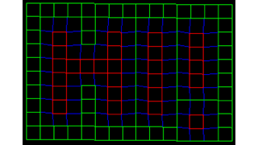
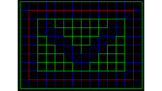

<table width="100%">
    <thead>
        <tr>
            <th></th>
            <th><h2 align="center">Welcome to my page!</h2></th>
            <th></th>
        </tr>
    </thead>
    <tbody>
        <tr>
            <td align="center"></td>
            <td align="center">
I'm Gabriel, feel free to ping me for more details about my work
            

            </td>
            <td align="center"></td>
        </tr>
    </tbody>
</table>

test[mai](mailto:gabriel.lindman@volvocars.com)

[linkedin]: https://www.linkedin.com/in/gabriel-lindman-829992186
[mail]: mailto:gabriel.lindman@volvocars.com

<!--
**GabrielSten/GabrielSten** is a ✨ _special_ ✨ repository because its `README.md` (this file) appears on your GitHub profile.

Here are some ideas to get you started:

- 🔭 I’m currently working on ...
- 🌱 I’m currently learning ...
- 👯 I’m looking to collaborate on ...
- 🤔 I’m looking for help with ...
- 💬 Ask me about ...
- 📫 How to reach me: ...
- 😄 Pronouns: ...
- ⚡ Fun fact: ...
-->
